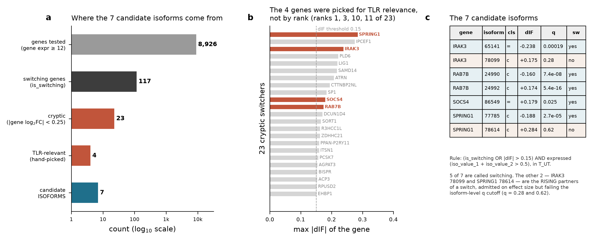
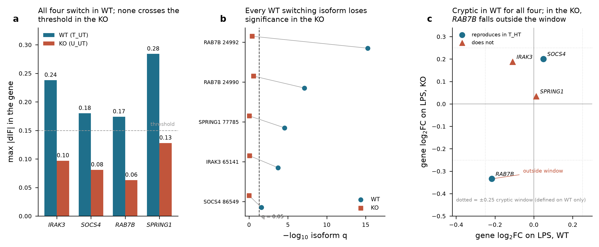
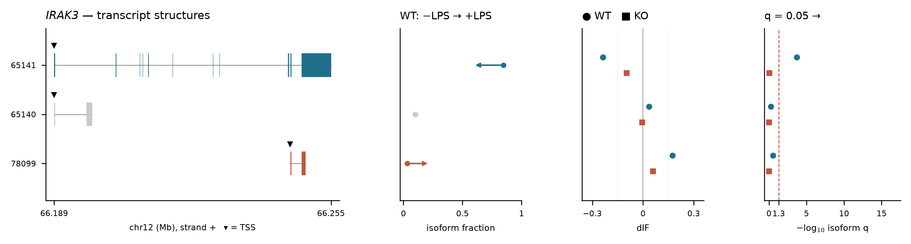
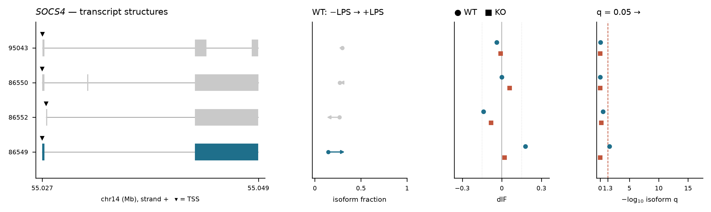
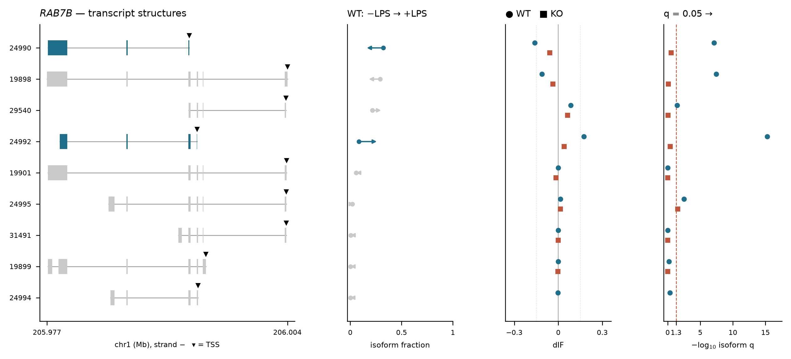
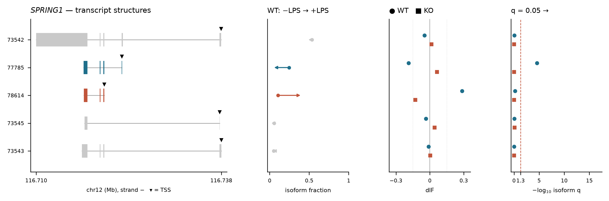

# The four candidate genes, seven candidate isoforms

Provenance of the candidate set, and a full per-gene story. Every number here is recomputed
from committed `data/processed/` plus `gff3/U_T.gff3`; per-isoform values are in
`tables/candidate_isoform_detail.csv`, structures in
`tables/candidate_transcript_structures.csv`, gene-level summary in
`tables/candidate_summary.csv`.

---

## Where the "7" comes from — and a correction

**The 7 is not in F1c.** `F1_scope.png` panel c shows 117 switching genes binned by gene-level
fold-change, of which 23 fall in the cryptic window. The 7 appears in `F5_implications.png`
panel a and in `tables/primer_designs.csv`. The chain is:

| stage | count | rule |
|---|---|---|
| genes tested | 8,926 | gene expression ≥ 12 (the config abundance floor) |
| switching genes | 117 | `is_switching` in T_UT |
| **cryptic switchers** | **23** | of those, \|gene log2FC\| < 0.25 |
| candidate genes | **4** | IRAK3, SOCS4, RAB7B, SPRING1 |
| **candidate isoforms** | **7** | (`is_switching` OR \|dIF\| > 0.15) AND expressed, within those 4 genes |

**The 4 genes were hand-picked for TLR-pathway relevance, not selected by rank.** Their ranks
within the 23 cryptic switchers by max \|dIF\| are **1 (SPRING1), 3 (IRAK3), 10 (SOCS4) and 11
(RAB7B)**. Genes ranked 2, 4-9 — IPCEF1, PLD6, LIG1, SAMD14, ATRN, CTTNBP2NL, SP1 — have
larger or comparable isoform shifts and were not carried forward. That is a defensible choice
for an assay-design exercise but it is **not** a statistical selection, and no claim of the
form "the top candidates are TLR genes" follows from it. The full ranked list is in panel b
and in `tables/cryptic_switchers_T_UT.csv`.

**5 of the 7 isoforms are called switching.** The other two — IRAK3 `TCONS_00078099` and
SPRING1 `TCONS_00078614` — are the *rising partners* of a switch, admitted on effect size
(\|dIF\| 0.175 and 0.284) but failing the isoform-level q cutoff (q = 0.28 and 0.62). They are
in the assay list because you cannot validate a switch by measuring only one side of it.

---

## The pattern common to all four

**a. Every gene switches in WT; none does in the KO.** Max \|dIF\| falls below the 0.15
threshold in all four (IRAK3 0.24 → 0.10, SOCS4 0.18 → 0.08, RAB7B 0.17 → 0.06, SPRING1
0.28 → 0.13).

**b. Every WT switching isoform loses significance in the KO.** RAB7B `24992` q = 5.4e-16 →
0.40; RAB7B `24990` 7.4e-08 → 0.27; IRAK3 `65141` 1.9e-04 → 0.86; SPRING1 `77785` 2.7e-05 →
0.95; SOCS4 `86549` 0.025 → 1.00.

**Do not over-read b.** These four genes were selected *because* they switch in WT, so their
WT q-values are small by construction — the fall in the KO is partly regression to the mean,
and n = 5 with no correction for having chosen the genes on the WT outcome. It is consistent
with the KO's blunted response but is not independent evidence for it. Under the project's own
convention this is a `selconf_`-class observation: descriptive only.

**c. All four are cryptic in WT; three of the four are also cryptic in the KO.** Gene-level LPS
log2FC stays inside the ±0.25 cryptic window in WT for all four (IRAK3 −0.109, SOCS4 +0.049,
RAB7B −0.217, SPRING1 +0.012). In the KO, **RAB7B falls outside it at −0.334** — the other
three stay in (IRAK3 +0.188, SOCS4 +0.201, SPRING1 +0.034). So the "invisible to differential
expression" property carries over to the second contrast for three genes but not for RAB7B,
whose gene-level LPS response in the KO is large enough to be picked up by gene-level DE.

RAB7B is also the gene whose absolute abundance differs most between arms (715 in WT vs 194 in
the KO, 3.7x), so its KO behaviour is the least comparable of the four on both counts. Note the
cryptic classification was only ever *defined* on the WT contrast — the KO column is a
descriptive check, not a selection criterion — so this does not remove RAB7B from the candidate
set. It does mean "cryptic in both arms" must not be stated as a property of the set.

**Reproduction in the independent T_HT annotation:** SOCS4 and RAB7B reproduce as switching;
SPRING1 is testable but does **not**; IRAK3 is **not testable** there (its gene expression is
10.3, below the floor of 12). So of the four, two reproduce, one fails, one cannot be checked.

---

## IRAK3 — a long dominant isoform giving way to a short 3' fragment

chr12, + strand. Gene expression 14.1 (just above the floor of 12), gene log2FC **−0.109**.

| isoform | class | exons | IF −LPS → +LPS | dIF | isoform q |
|---|---|---|---|---|---|
| `TCONS_00065141` | `=` | 12 | 0.846 → 0.608 | **−0.238** | **1.9e-04** |
| `TCONS_00078099` | `c` | 3 | 0.032 → 0.207 | +0.175 | 0.28 |
| `TCONS_00065140` | `=` | 2 | 0.100 → 0.137 | +0.036 | 0.55 |

The full-length 12-exon transcript spanning 65 kb loses a quarter of its share. The gaining
isoform is a 3-exon, 3.7 kb fragment confined to the 3' end of the locus (66,244,975-66,248,636)
with a TSS **55.8 kb downstream** of the long form's — a different promoter entirely, not an
alternative splice of the same pre-mRNA. IRAK3 (IRAK-M) is a negative regulator of TLR
signalling, so a shift from full-length toward a truncated form is mechanistically
interesting; but the gaining isoform's q = 0.28 means the *rise* is not individually
significant, only the fall.

**Caveats specific to IRAK3.** Gene expression 14.1 sits barely above the abundance floor,
where dIF rests on few reads — exactly the regime `02d` was written to guard. It is **not
testable in T_HT** (expression 10.3 there), so this is the one candidate with no
cross-annotation check at all. Treat it as the least secure of the four despite being the most
attractive biologically.

---

## SOCS4 — a minor isoform doubling its share, all four sharing one 3' exon

chr14, + strand. Gene expression 23.0, gene log2FC **+0.049**.

| isoform | class | exons | IF −LPS → +LPS | dIF | isoform q |
|---|---|---|---|---|---|
| `TCONS_00086549` | `=` | 2 | 0.144 → 0.324 | **+0.179** | **0.025** |
| `TCONS_00086552` | `=` | 2 | 0.268 → 0.129 | −0.138 | 0.30 |
| `TCONS_00095043` | `j` | 3 | 0.298 → 0.260 | −0.038 | 0.85 |
| `TCONS_00086550` | `=` | 3 | 0.270 → 0.269 | −0.001 | 1.00 |

The cleanest case structurally: four isoforms with nearly identical spans (55,027,2xx-55,049,4xx)
sharing a large common 3' exon, differing in their 5' region and internal junction use. The
switch is a reciprocal exchange between two 2-exon forms — `86549` up, `86552` down — with the
two 3-exon forms unchanged. This is the only candidate whose event is a genuine internal
rearrangement rather than a truncation.

**Reproduces in T_HT** (1 switching isoform there). q = 0.025 is the weakest of the five
switching calls, so it sits closest to the cutoff.

---

## RAB7B — the highest-confidence event, and the only well-expressed gene

chr1, − strand. Gene expression **714.6** in WT (194.0 in KO), gene log2FC **−0.217**.
9 expressed isoforms — the most complex of the four.

| isoform | class | exons | IF −LPS → +LPS | dIF | isoform q |
|---|---|---|---|---|---|
| `TCONS_00024992` | `c` | 4 | 0.084 → 0.258 | **+0.174** | **5.4e-16** |
| `TCONS_00024990` | `c` | 3 | 0.321 → 0.161 | **−0.160** | **7.4e-08** |
| `TCONS_00019898` | `=` | 6 | 0.292 → 0.181 | −0.110 | 3.6e-08 |
| `TCONS_00029540` | `c` | 4 | 0.216 → 0.300 | +0.084 | 0.034 |
| `TCONS_00024995` | `j` | 6 | 0.020 → 0.035 | +0.015 | 0.0029 |
| 4 others | `=`/`j` | 4-6 | ≤ 0.058, unchanged | ≤ 0.003 | ns |

**The strongest statistics in the set by orders of magnitude** — q = 5.4e-16 — which follows
directly from the abundance: at gene expression 715 the isoform fractions are well determined.
Note that *five* isoforms have q < 0.05 here, so this is a multi-way redistribution rather
than a two-isoform switch: the 6-exon reference form `19898` and the 3-exon `24990` both fall,
while the 4-exon `24992` and `29540` both rise. RAB7B negatively regulates TLR4 signalling by
directing the receptor to lysosomal degradation.

**Reproduces in T_HT.** Also the one gene where the KO's gene-level expression differs sharply
from WT (194 vs 715) — worth keeping in mind, since that is a 3.7x abundance difference between
arms, not just a response difference.

---

## SPRING1 — the largest isoform shift in the whole cryptic set, and the weakest evidence

chr12, − strand. Gene expression 32.1, gene log2FC **+0.012** — the most perfectly cryptic gene
in the set.

| isoform | class | exons | IF −LPS → +LPS | dIF | isoform q |
|---|---|---|---|---|---|
| `TCONS_00078614` | `c` | 3 | 0.106 → 0.391 | **+0.284** | **0.62** |
| `TCONS_00077785` | `c` | 4 | 0.245 → 0.057 | **−0.188** | **2.7e-05** |
| `TCONS_00073542` | `=` | 5 | 0.536 → 0.490 | −0.046 | 0.89 |
| `TCONS_00073545` | `=` | 2 | 0.055 → 0.021 | −0.034 | 0.88 |
| `TCONS_00073543` | `=` | 4 | 0.051 → 0.040 | −0.011 | 0.92 |

**The largest \|dIF\| of any cryptic switcher (0.284) carries q = 0.62.** That combination is
the important observation here: a near-fourfold change in isoform fraction that the
isoform-level test does not support. The reciprocal fall in `77785` *is* highly significant
(2.7e-05), so the gene is called switching on that isoform alone. Both are short `c`-class
truncations nested within the dominant 5-exon `73542`, which barely moves.

**This is the weakest candidate despite topping the \|dIF\| ranking.** It does **not** reproduce
in T_HT (testable, 0 switching isoforms there), and its headline effect size is the one that
fails significance. If a single candidate should be dropped from the assay panel, this is it.

---

## Assay consequences

From `tables/primer_designs.csv` and the nesting analysis (`F5_implications.png`): of these 7
isoforms, **5 are fully nested** inside a longer isoform of the same gene and **1 more**
(SOCS4 `86549`) has no unique sequence ≥ 60 bp despite a distinct structure. Only IRAK3
`TCONS_00065141` is uniquely addressable by qPCR (1 of 315,349 transcripts amplified).

The recurring reason is visible in the structure panels: most of the gaining isoforms are
short `c`-class truncations sitting inside a longer form, distinguished only by where they
start. That makes 5' end methods — 5' RACE, CAGE, or targeted long-read cDNA — the appropriate
assays, and it is also why the switching in these genes is better described as **TSS selection
than as splicing**.
