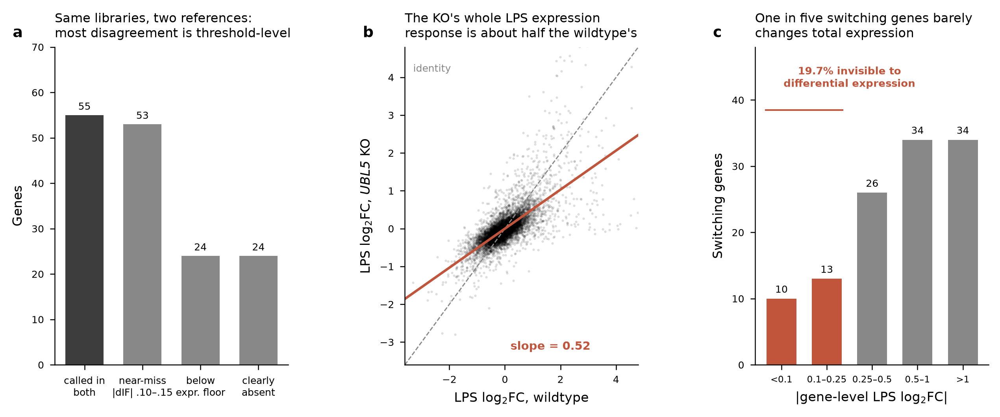
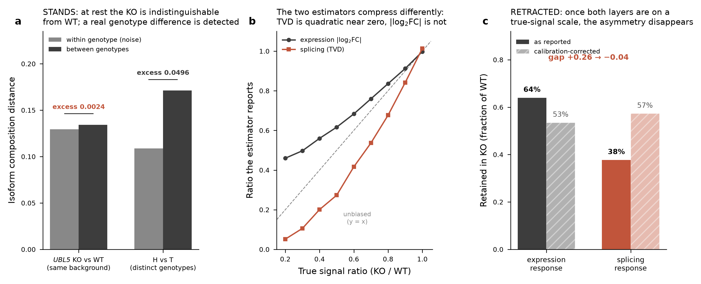
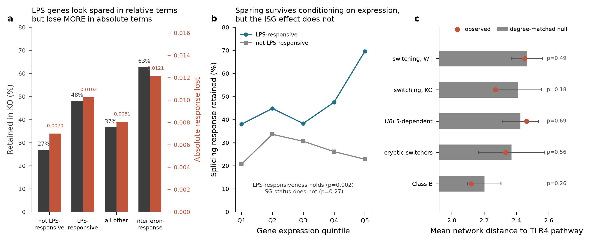
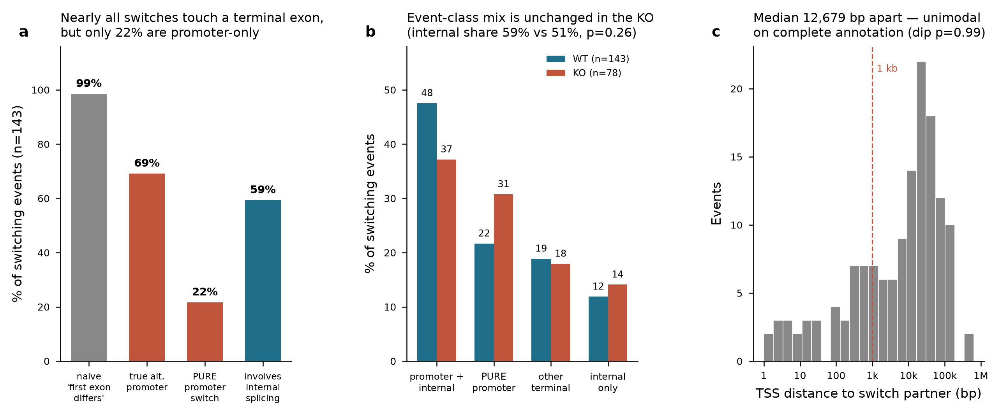
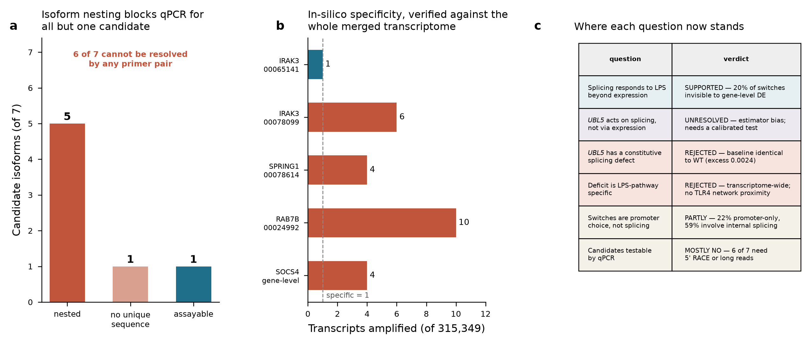

# The analysis start to finish, in five figures

A narrated walkthrough of the external review. Each panel traces to a CSV in `tables/`;
every number below is computed from those tables, not typed from prose. Read this first,
then `HANDOFF.md` for the work items and `EXPERIMENTS.md` for the wet-lab proposal.

Two questions are kept separate throughout, because they have different answers:

- **Q1.** What is the role of alternative splicing in the LPS/TLR4 response?
- **Q2.** Is UBL5 a credible splicing-regulation candidate, and what is it doing?

---

## F1 — What the data is, and whether it holds up

**a. Same libraries, two references.** `T_HT` and `T_UT` are the *same six libraries*
quantified against two different merged transcriptomes, which makes them a reproducibility
control. Of 156 genes called switching in either, 55 are called in both. Most of the
disagreement is threshold-level rather than contradictory: 53 more are near-misses
(|dIF| 0.10-0.15 in the reference that did not call them) and 24 fall below the gene
expression floor. Only 24 are clearly absent. Note the two references are *not* the same
transcript space — HT merges T+H PacBio transcripts, UT merges T+U — so part of this is
genuine annotation difference, not measurement noise.
Backing: `tables/review_findings.csv`.

**b. The KO's LPS expression response is roughly halved.** Regressing the KO's gene-level
LPS log2 fold-change on the wildtype's across 8,595 genes gives a slope of **0.516**. This
is a global property of the knockout, not something specific to isoform switching, and it is
the confounder that motivated most of what follows.

**c. One in five switching genes is invisible to differential expression.** Among 117
switching genes, 23 (**19.7%**) have |gene-level log2FC| < 0.25 — the isoform composition
shifts while total output barely moves. These include TLR-pathway regulators (IRAK3, SOCS4,
RAB7B). This is the direct answer to "does the splicing layer see things gene-level
expression is blind to": yes, for about a fifth of switching genes.
Backing: `tables/cryptic_switchers_T_UT.csv`.

---

## F2 — Q2: what UBL5 is actually doing

**This figure records a retraction.** Earlier versions of this review made the
expression-vs-splicing asymmetry the load-bearing claim for a splicing-specific UBL5 role.
`scripts/10_layer_estimator_calibration.R` (Claude Code, commit 36690a2) showed that claim
rests on comparing two estimators biased in opposite directions. I verified the argument,
reproduced the calibration exactly, and **the asymmetry does not survive it.** Panel a still
stands; panels b-c document why the asymmetry does not.

**a. There is no constitutive splicing defect.** Comparing *unstimulated* cells only, using
per-gene isoform composition distance over shared isoforms and calibrating against
within-genotype replicate pairs: the KO's excess over replicate noise is **0.0024** —
essentially nil. The positive control, two genuinely different genotypes (H vs T), gives
**0.0496**, about 21x larger. So the assay detects real composition differences, and the KO
at rest does not have one. Whatever UBL5 does, it is condition-dependent.
Backing: `tables/baseline_composition_test.csv`.

**b. The two estimators compress signal at different rates.** Expression response is
|log2FC| between condition means — averaging three replicates *before* the absolute value, so
the estimate tracks truth almost linearly. Splicing response is a total variation distance, a
sum of absolute values, which does not average out noise: for signal small relative to noise,
E|s+n| ≈ E|n| + O(s²), so the estimator is roughly **quadratic** near zero and compresses
ratios toward 0. Simulating a known ratio, a genotype with 60% of the true signal reads as
68% by the expression estimator but only 42% by the splicing estimator. Comparing an
upward-biased number to a downward-biased one manufactures an asymmetry even when both
layers are reduced by exactly the same factor.
Backing: `tables/layer_estimator_calibration.csv`.

**c. Inverting the calibration destroys the asymmetry.** The reported 64% / 38% becomes
**53% / 57%** on a true-signal scale — the observed gap of **+0.26 becomes −0.04**, i.e. the
splicing layer is no longer the more-degraded one. That is enough to retract the claim: the
sign of the effect depends entirely on the estimator.

**The two corrected analyses agree only on direction, not magnitude — do not overstate this.**
The pipeline's own estimator (observed 60% / 65%) corrects to 48% / 75%, a gap of −0.27,
against the external review's −0.04. Both corrected gaps are ≤ 0, so neither supports
"splicing degrades more"; but they differ by **23 points** and the pipeline's version implies
splicing is retained ~1.6x *better* than expression, which the external review's does not.
The honest reading is that after correction **no reliable cross-layer ordering can be
extracted from either estimator** — not that both converge on parity.
Backing: `tables/layer_retention_corrected.csv`.

**I checked whether matching the estimator structure rescues the comparison. It does not.**
Applying an identical across-minus-within pairwise form to both layers narrows the gap from
26 to 14 points (expression 53.7%, splicing 39.9%) but cannot close it, because compression
depends on **signal-to-noise**, not just estimator form — and the layers differ there by
**20×** (WT expression SNR 1.81, splicing 0.09). At SNR 0.09 the splicing estimator is deep
in the quadratic regime while expression is not. Matched structure is necessary, not
sufficient.
Backing: `tables/layer_matched_estimator.csv`, `tables/layer_snr.csv`.

**What this does and does not overturn.** It does **not** show UBL5 has no splicing-specific
role — it shows this measurement cannot demonstrate one in either direction. It does not
touch panel a (a within-layer comparison, no cross-layer ratio involved), and it does not
touch the globally blunted LPS expression response, which rests on expression alone. The
mediation decomposition (36% / 64%, `tables/mediation_decomposition.csv`) inherits the same
compressed splicing estimator and **should not be quoted** until recomputed on a calibrated
scale. The simulation assumes Gaussian homoscedastic noise, so the magnitude of the
correction is approximate; the *direction* of the two biases is not — it follows from the
algebra of averaging before versus after an absolute value.

**Resolving this properly** needs an estimator whose bias does not depend on which layer it
is applied to: a formal differential-splicing model (DRIMSeq or satuRn) that returns a
per-gene effect size on a comparable scale for both layers, rather than a
noise-subtracted distance.

---

## F3 — Three things the deficit is *not*

**a. The apparent sparing of LPS genes is a scale artefact.** On the relative scale,
LPS-responsive genes retain 48% and interferon-response genes 63%, against a transcriptome
average of 37% — which looks like those pathways being protected. On the **absolute** scale
the same genes lose *more* response (0.0102 and 0.0121 vs 0.0081). Both statements come from
the same table; the ratio framing alone is misleading.
Backing: `tables/sparing_relative_vs_absolute.csv`.

**b. Conditioning on expression separates the two.** Within expression quintiles,
LPS-responsiveness remains significant (p = 0.002) but **ISG status does not** (p = 0.27) —
the interferon effect was abundance. The LPS-responsive gap is present in every quintile and
widens at the top (Q1 38.0% vs 20.7%; Q5 69.6% vs 22.8%), so the effect is not a by-product
of responsive genes being more abundant.
Backing: `tables/sparing_conditioned_on_expression.csv`, `tables/sparing_by_expression_quintile.csv`.

**c. No candidate set sits closer to TLR4 than chance.** Using the full STRING v12 human
physical interactome (15,809 proteins, 210,667 edges at score >= 400) seeded with 33
TLR4-pathway proteins, and testing against a **degree-matched null** — essential, because
hub genes are close to everything — every set is non-significant: switching in WT p = 0.49,
KO p = 0.18, UBL5-dependent p = 0.69, cryptic p = 0.56, Class B p = 0.26. The reason is
structural, and visible in the null itself: degree-matched *random* genes sit only
**2.20-2.47 steps** from the pathway on average, with SD 0.10-0.24. In a network this dense
almost every expressed gene is two to three steps from TLR4, so distance carries almost no
discriminating information.
Backing: `tables/network_distance_to_TLR4.csv`.

Two positive results survive from the network work and are in `fig_network.png`: a short list
of candidates that are genuine direct physical interactors of pathway components
(`tables/direct_TLR4_interactors.csv`), and UBL5's own neighbourhood — **62% of its 82
partners are core spliceosome or RBP**, including the direct SART1 edge (the mammalian
counterpart of the known Hub1-Snu66 interaction). Its single apparent TLR4 link is to UBE2N
and is best read as ubiquitin-system co-annotation, not signalling.
Backing: `tables/ubl5_interactome.csv`.

---

## F4 — Q1: what the switching events structurally are

Literature (Robinson 2021) reports that roughly half of macrophage LPS splicing changes are
alternative-first-exon events — promoter choice, not spliceosome catalysis. If that held
here it would undercut attributing anything to a spliceosome modifier. This figure uses the
project's own `gff3/U_T.gff3` and resolves **143 of 143** WT switching events (an earlier
Ensembl-only pass reached 68, and gave materially different answers — see `HANDOFF.md` items
4-5).

**a. Nearly everything touches a terminal exon, but few are promoter-only.** 98.6% of events
differ in their first exon — which is why the impression that "it's all first/last exon" is
well founded. But applying a stringent criterion (disjoint first exon *and* TSS > 1 kb
apart), **69.2%** are true alternative promoters and only **21.7%** are *pure* promoter
switches with no internal junction change. **59.4%** involve a genuine internal junction
change. So Robinson's concern applies to about a fifth of events, not half.

**b. The event-class mix is unchanged in the KO.** Four-way classification: 47.6% promoter
change *plus* internal splicing, 21.7% pure promoter, 18.9% other terminal, 11.9% internal
only. The KO's mix is similar (37.2 / 30.8 / 17.9 / 14.1) and the internal-splicing share
does not differ significantly (59.4% vs 51.3%, Fisher p = 0.26). UBL5 loss does **not**
selectively remove one event class.

**c. TSS distances are unimodal.** Median **12,679 bp** between switch partners, Hartigan
dip p = 0.99. An apparent bimodality on the Ensembl subset (dip p = 0.008) did not survive
complete annotation and is retracted; it came from coordinate disagreement between the two
annotations (Spearman 0.649), not from biology.
Backing: `tables/event_structure_summary_gff3.csv`, `tables/event_structure_WT_gff3.csv`,
`tables/event_structure_KO_gff3.csv`.

**Interpretive consequence.** If ~22% of events are pure promoter switches and much of the
rest involves 5' truncation, then a substantial fraction of what the pipeline reports as
"isoform switching" is **TSS selection**. That is a real regulatory layer worth claiming —
it is just not a spliceosome one, and the reports should not describe it as splicing.

---

## F5 — What follows experimentally

**a-b. Most candidates cannot be assayed by qPCR, for a structural reason.** Of 7 candidate
isoforms, **5 are fully nested** inside a longer isoform — every junction and every base they
contain is also present in the host transcript, so no primer pair can distinguish them. A
6th (SOCS4 `TCONS_00086549`) is not nested but still has **zero unique sequence >= 60 bp**,
because other isoforms tile across all of it. That leaves **one** designable assay:

| IRAK3 long form, `TCONS_00065141` | |
|---|---|
| forward | `GAGACTTTCAAGCAGCTGGCTG` (Tm 60.1) |
| reverse | `ACCTGTAAAAGGTCACCGATGGTC` (Tm 60.1) |
| product | 129 bp |
| specificity | **1 of 315,349 transcripts** |
| region | chr12:66203711-66203893, unique to the long isoform |

Specificity was verified empirically by matching both primers against every transcript in
`fa/transcripts_U-T.fa`, not predicted. The 5'-anchored alternatives amplify 4-10 transcripts
each, exactly as nesting predicts.
Backing: `tables/primer_designs.csv`.

**The right assays instead.** The discriminating feature for the nested isoforms is the 5'
end (TSS 863 bp to 55.8 kb apart), so **5' RACE, CAGE, or targeted long-read cDNA** are the
appropriate methods. Long-read cDNA on the validation RNA would resolve all seven at once
and is likely cheaper than developing six assays that cannot work. Full proposal, ordered
cheapest-potentially-fatal-first, in `EXPERIMENTS.md`.

**c. Where each question stands.**

| question | verdict |
|---|---|
| Splicing responds to LPS beyond what expression shows | **Supported** — 19.7% of switching genes are invisible to gene-level DE |
| UBL5 acts on splicing, not merely via expression | **Unresolved** — the layer asymmetry was an estimator artefact (F2b-c). The spliceosomal interactome (62% of 82 partners, SART1 edge) is suggestive but is annotation, not measurement |
| UBL5 has a constitutive splicing defect | **Rejected** — baseline composition identical to WT (excess 0.0024 vs 0.0496 positive control) |
| The deficit is LPS-pathway-specific | **Rejected** — transcriptome-wide; no TLR4 network proximity above a degree-matched null |
| The switches are promoter choice, not splicing | **Partly** — 21.7% promoter-only, but 59.4% involve internal splicing |
| Candidates are testable by qPCR | **Mostly no** — 6 of 7 need 5' RACE or long reads |

---

## Method caveat

Everything here derives from ISA's condition means and replicate isoform fractions. The
composition measure (total variation distance over renormalised isoform fractions, calibrated
against within-condition replicate pairs) is a reasonable summary but **is not a formal
differential-splicing test** — and F2b-c is the concrete cost of that: the layer asymmetry I
originally made load-bearing did not survive calibration. A purpose-built method (DRIMSeq or
satuRn, with the pairing included if the design is paired), run on the count matrices rather
than condition means, is now the blocking step for the whole UBL5 question rather than a
nice-to-have.

The general lesson, worth carrying to the other findings: **any claim of the form "layer X is
affected more than layer Y" needs its estimators calibrated before it is believed.** The
findings in F1, F3 and F4 do not have this problem — they are within-layer comparisons,
proportions, or structural classifications, none of which compare two differently-biased
estimators.

Sample naming (`T1_minus`/`T1_plus` ... at n = 3) implies a **paired** design. That was
inferred from filenames and has not been confirmed. Do not change the model on that basis —
confirm with the experimentalist first, then decide.
